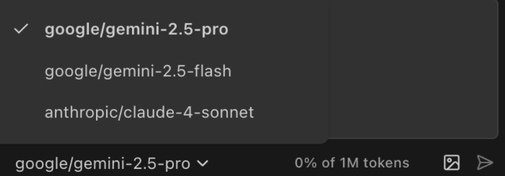

## **Account & Support**

### **Usage**

Understanding Pochi's model support and credit system helps you optimize your development workflow and manage costs effectively.

#### **What models are supported in Pochi**

Pochi offers multiple LLM choices to match different development needs and budget requirements.

**Claude 4 Sonnet** (Primary recommendation)
* Best overall performance for code generation and complex reasoning
* Excellent at understanding visual inputs and design conversion
* Optimal for full-stack development tasks and architectural decisions

**Gemini 2.5 Pro** (High-performance option)
* Strong performance for web development and API integration
* Excellent at following coding standards and best practices
* Great for complex component generation and system design

**Gemini 2.5 Flash** (Fast and cost-effective)
* Quick response times for rapid development cycles
* Budget-friendly while maintaining good code quality
* Suitable for simpler development tasks and prototyping

**Switching Models**: You can change models mid-task based on complexity requirements without losing context.

### **How is credit counted**

Pochi uses a credit-based system that charges based on model usage and task complexity. The credit is directly correlated to the number of API calls. We now have two tiers of credit: Basic (Gemini 2.5 Flash), and Premium (Gemini 2.5 Pro, and Claude 4 Sonnet).

### **Privacy**

For comprehensive information about how Pochi handles your data, code, and personal information, please refer to our [Privacy Policy](https://app.getpochi.com/privacy-policy).

### **Support & Community**

Get help, share feedback, and connect with other Pochi users through our [Discord](http://discord.gg/tWF66yr8NQ) community channels. We'd love to invite you to share tips and best practices, provide feedback, and engage with the team in our community. 