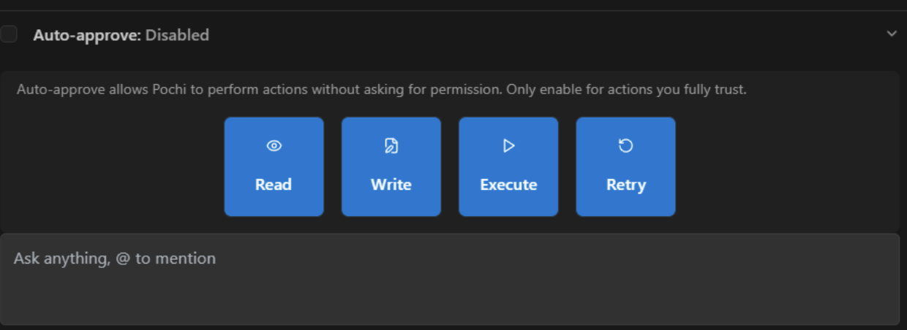
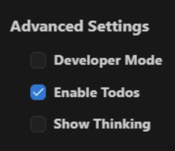
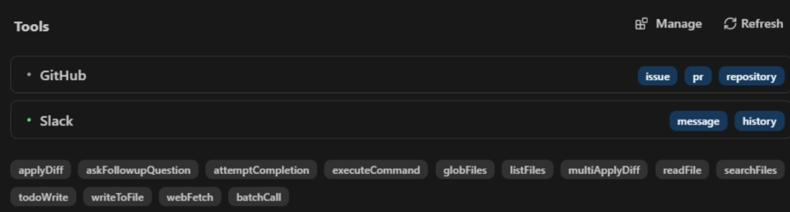

## **Features**

## **Tasks**

Tasks represent discrete development objectives Pochi manages from conception to completion. Each task maintains its own context, progress tracking, and collaboration thread within your team's workspace.

Tasks differ from simple prompts by maintaining persistent context, enabling collaborative development, and chain of conversations..

### Start a Task

**Task Thread Features:**

**Automatic Planning**: Pochi analyzes your request and creates a structured development plan in the thread

**Progress Updates**: Regular status messages showing completed work and next steps

**Code Sharing**: Generated files and components posted directly for team review

**Collaborative Input**: Team members can suggest changes or provide additional requirements

**Approval Workflow**: Request review from team leads before implementation or deployment

### Interruption (Rejection, Editing)

Tasks can be modified, redirected, or refined at any point during execution while maintaining team visibility and context.

**Types of Task Interruptions:**

**Requirement Changes**: Modify the task scope or specifications

```js
"Actually, let's add social login options to that auth component"
"Change the color scheme to match our new brand guidelines"
```

**Approach Rejection**: Request a different implementation strategy

```js
"This responsive approach won't work - let's use CSS Grid instead"
"Switch from REST API to GraphQL for this integration"
```

**Priority Adjustments**: Reorder or pause task execution

```js
"Pause this task - we need to handle the security audit first"
"Prioritize the mobile layout before adding advanced features"
```

**Team Feedback Integration**: Incorporate input from other team members

```js
"Sarah's right about the accessibility concerns - let's add ARIA labels"
"Following up on John's performance comment - implement lazy loading"
```

**Task Modification Workflow:**

**Immediate Updates**: Changes are reflected in the task thread with updated plans and timelines

**Team Notification**: All thread participants are notified of scope or approach changes

**Context Preservation**: Previous work and decisions remain accessible in the thread history

**Seamless Continuation**: Development resumes with new requirements while maintaining consistency

## **Auto Approve**

Auto-approve allows Pochi to execute certain actions autonomously without requiring manual confirmation for each step, streamlining your development workflow.



### How it works

By default, Pochi will ask for your permission before taking any action, including reading or writing files.
If you want to allow Pochi to do something without asking, you can set the Auto Approve permission for that action.

### Permission Options

**Read Operations**

* **Source Code Analysis**: Examines files to understand structure and context
* **Configuration Files**: Reads package.json, tsconfig.json, and other config files
* **Documentation**: Analyzes README files and project documentation
* **Architecture Understanding**: Traverses directories to map project structure

**Write Operations**

* **File Creation**: Generates new files with complete implementations
* **Code Editing**: Makes targeted changes to existing files
* **Boilerplate Generation**: Creates templates and starter code
* **Configuration Updates**: Modifies config files as needed
* **Documentation**: Writes comments and documentation

**Execute Operations**

* **Dependency Management**: Runs npm install, pip install, etc.
* **Build Processes**: Executes npm run build and similar commands
* **Testing**: Runs test suites with npm test, pytest, etc.
* **Development Servers**: Starts dev servers with npm run dev
* **Version Control**: Performs git operations
* **System Operations**: Handles file management and system tasks

**Retry Logic**

* **Command Failures**: Analyzes errors and tries alternative solutions
* **Code Issues**: Reverts problematic changes and attempts different implementations
* **Dependency Problems**: Tries different package managers or versions when installations fail

### Best Practices

For most serious development workflows, we recommend starting with:

* Auto-approving read access to project files
* Setting a reasonable maximum request limit (10-20) [able to adjust?]

This gives Pochi enough freedom to explore your codebase without constant interruptions, while still requiring permission for edits or potentially destructive actions.

As you build more trust in Pochi's capabilities with your specific projects, you can gradually increase the permissions to match your comfort level.

Remember that you can always adjust these settings as your needs change - tighten permissions for critical production work, or loosen them when prototyping and exploring.

## **Advanced Settings**

Configure Pochi's behavior with advanced options to customize your development workflow and debugging experience.



### Developer Mode

Enable enhanced debugging capabilities and detailed execution visibility for advanced users.

**When enabled, Developer Mode provides:**

* Detailed execution logs showing Pochi's decision-making process
* Extended error messages with debugging context
* Access to experimental features and model configurations
* Performance metrics for request processing and code generation

**Use Developer Mode when:**

* Troubleshooting complex development issues
* Understanding how Pochi approaches specific problems
* Testing new integrations or workflows
* Contributing feedback on experimental features

### Enable Todos

Control whether Pochi automatically creates TODO lists for complex development requests.

**When enabled:**

* Complex requests are broken down into step-by-step TODO lists
* Progress tracking shows completed, current, and upcoming items
* TODO lists can be edited and modified in real-time
* Provides transparency into Pochi's planned approach

**When disabled:**

* Pochi executes requests without creating visible TODO breakdowns
* Faster execution for users who prefer less granular visibility
* Suitable for simple requests or experienced users who don't need step-by-step tracking

### Show Thinking

Display Pochi's internal reasoning process before generating responses and code.

**When enabled:**

* Shows Pochi's analysis of your request before implementation
* Reveals decision-making process for technical choices
* Helps understand why specific approaches were selected
* Useful for learning and validation of AI reasoning

## **TODO List**

The TODO List provides transparent, step-by-step execution of development tasks, showing exactly what Pochi plans to do and allowing real-time modifications.


### What is TODO List / Step-by-Step Execution

TODO Lists break down your development requests into specific, actionable steps that Pochi executes in sequence, providing complete visibility into the development process.

**How TODO Lists Work**

When you describe a complex task, Pochi creates a comprehensive TODO list covering:

* Project setup and file structure
* Component or feature development steps
* Styling and responsive design implementation
* Testing and validation requirements
* Documentation and deployment preparation

**Example TODO Breakdown:**

```text
Request: "Build a blog system with admin panel"

Generated TODO List:
□ 1. Set up project structure and dependencies
□ 2. Create database schema for posts and users
□ 3. Build authentication middleware and user management
□ 4. Implement blog post CRUD operations
□ 5. Create admin interface for content management
□ 6. Design responsive frontend for blog display
□ 7. Add comment system with moderation
□ 8. Set up deployment configuration
```

**Real-Time Progress**: As Pochi works through the list:

* Completed items are marked with ✅
* Current work is highlighted
* Remaining steps provide clear visibility into upcoming work
* Estimated time for completion is updated

### TODO List Interruption and Management

**Interruption (Rejection, Editing)**

Pochi's collaborative approach allows you to interrupt, redirect, or refine work at any stage while preserving context and progress.

**Types of Interruptions:**

**Scope Changes**: Modify requirements mid-development

```js
"Stop - add a dark mode toggle to this component before continuing"
"Change the database from SQLite to PostgreSQL"
```

**Approach Rejection**: Request a different implementation strategy

```js
"This layout won't work on mobile. Use a card-based design instead"
"Don't use inline styles - let's go with CSS modules"
```

**Priority Shifts**: Reorder TODO execution

```js
"Skip the styling for now - let's focus on the API integration first"
"Move the testing TODO to happen after each component is built"
```

**Requirement Additions**: Expand the TODO scope

```js
"Also add user role permissions to this auth system"
"Include email notifications for form submissions"
```

**Pochi's Context Preservation During Interruptions:**

**Work History**: Completed TODO items remain intact and available for reference

**Project Structure**: File organization and naming patterns are maintained

**Code Patterns**: Established coding style and architecture decisions persist

**Dependencies**: Package installations and configurations are preserved

**Seamless Recovery**: When resuming work after interruption:

* Pochi incorporates your feedback into the updated approach
* TODO list automatically reflects new requirements
* Progress continues from the logical checkpoint
* Consistency with completed work is maintained

## Rules

Rules define how Pochi approaches development tasks across a workspace, ensuring consistency and adherence to your coding standards.


**Global Rules** (Apply to all projects):


**Project-Specific Rules** (`README.pochi.md` file):

Example: E-commerce Platform Development Rules

**Technology Stack**

- Next.js 14+ with App Router required
- Tailwind CSS for all styling
- Prisma for database operations
- Stripe for payment processing

**Business Logic Requirements**

- All monetary values in cents (avoid floating point)
- User authentication required for checkout
- Inventory validation before order confirmation

## Workflows

Workflows automate common development sequences, allowing you to execute complex tasks with simple commands.

**Component Creation Workflow:**

### React Component Workflow

1. Structure Setup
   - Create component directory with index file
   - Generate TypeScript interface for props
   - Set up CSS module or styled-components
2. Implementation
   - Build functional component with proper typing
   - Implement core functionality with hooks
   - Add error handling and loading states
3. Testing & Documentation
   - Write unit tests with React Testing Library
   - Create Storybook story for component showcase
   - Generate prop documentation with examples

**Workflow Execution**: Simply reference a workflow by name:

"Follow the Component Creation Workflow to build a user notification badge"

"Use the API Integration Workflow for the payment processing endpoints"

## **Tools & Integrations**

Pochi integrates with your existing development tools and platforms to seamlessly fit into your workflow. These integrations extend Pochi's capabilities and enable collaborative development across your team's tech stack.



### Available Integrations

**Slack**

* Start development tasks directly from Slack channels
* Real-time progress updates in conversation threads
* Team collaboration and feedback on development work
* File sharing for generated code and assets
* Task management with team visibility

**GitHub**

* Repository access for context-aware development
* Pull request creation and code review assistance
* Issue tracking and automated task creation from GitHub issues
* Branch management and merge conflict resolution
* Commit message generation following conventional standards

### Setting up Integrations

**Accessing Integration Settings:**

1. Navigate to Settings in your Pochi dashboard
2. Click "Manage" under the Tools section

## MCP

Model Context Protocol (MCP) extends Pochi's capabilities by enabling secure integration with external services, databases, and APIs directly within your development workflow.

### What is MCP

Model Context Protocol is an open protocol that standardizes how applications provide context to LLMs. Think of MCP like a USB-C port for AI applications; it provides a standardized way to connect AI models to different data sources and tools.

MCP servers act as intermediaries between Pochi and external tools or data sources. They are small programs that expose functionalities to Pochi, enabling it to interact with the outside world through the MCP.

**Key Concepts**

MCP servers define a set of "tools," which are functions Pochi can execute. These tools offer a wide range of capabilities.

Here's how MCP works:

* MCP hosts discover the capabilities of connected servers and load their tools, prompts, and resources
* Resources provide consistent access to read-only data, akin to file paths or database queries
* Security is ensured as servers isolate credentials and sensitive data. Interactions require explicit user approval

**Use Cases**

Here are some concrete examples of how MCP servers can be used:

**Database Operations:**

* Generate weekly sales reports
* Analyze customer behavior patterns
* Create real-time dashboards for business metrics

**API Testing and Integration:**

* Monitor API endpoints for response times
* Validate endpoint functionality
* Generate TypeScript interfaces from API responses

**Cloud Service Management:**

* Deploy applications to cloud platforms
* Configure environment variables
* Set up monitoring and alerts

### Config MCP Server in Pochi

Setting up MCP servers in Pochi allows you to connect external services to your development workflow.

**Accessing MCP Configuration:**

1. Click the "MCP Servers" icon in Pochi's interface
2. Select "Add New Server" to configure a new integration
3. Choose from pre-built servers or add custom configurations

**Configuration Options:**

**Database Connections:**

```json
{
  "name": "postgres-database",
  "type": "database", 
  "config": {
    "host": "localhost",
    "port": 5432,
    "database": "development",
    "user": "developer"
  },
  "autoApprove": ["read_tables", "describe_schema"]
}
```

**API Services:**

```json
{
  "name": "github-integration",
  "type": "github",
  "config": {
    "token": "ghp_your_token_here",
    "repositories": ["your-org/your-repo"]
  },
  "autoApprove": ["read_files", "list_issues"]
}
```

**Server Management:**

* **Enable/Disable Servers**: Toggle servers on/off based on project needs
* **Permission Controls**: Set auto-approve permissions for different operation types
* **Monitoring and Logs**: View real-time activity and connection health
* **Security Best Practices**: Use environment variables for credentials and implement least-privilege access

**Getting Started**

Pochi does not come with any pre-installed MCP servers. You'll need to find and install them separately.

Choose the right approach for your needs:

* **Ask Pochi**: You can ask Pochi to help you find or create MCP servers
* **Build Your Own**: Create custom MCP servers using the MCP SDK
* **Community Repositories**: Check for community-maintained lists of MCP servers

**Security Considerations**

When working with MCP servers, it's important to follow security best practices:

* **Authentication**: Always use secure authentication methods for API access
* **Environment Variables**: Store sensitive information in environment variables
* **Access Control**: Limit server access to authorized users only
* **Data Validation**: Validate all inputs to prevent injection attacks