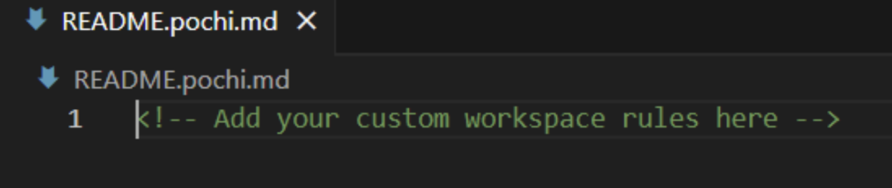

Rules define how Pochi approaches development tasks across a workspace, ensuring consistency and adherence to your coding standards.

## Global Rules (Apply to all projects):

## Project-Specific Rules (`README.pochi.md` file):

Example: E-commerce Platform Development Rules

**Technology Stack**

- Next.js 14+ with App Router required
- Tailwind CSS for all styling
- Prisma for database operations
- Stripe for payment processing

**Business Logic Requirements**

- All monetary values in cents (avoid floating point)
- User authentication required for checkout
- Inventory validation before order confirmation
